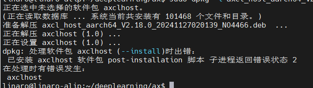
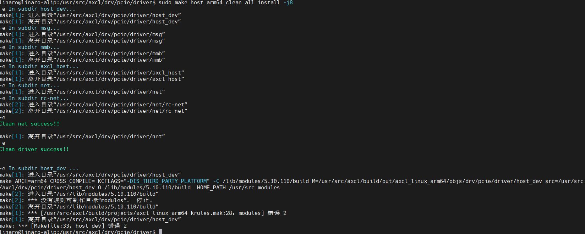
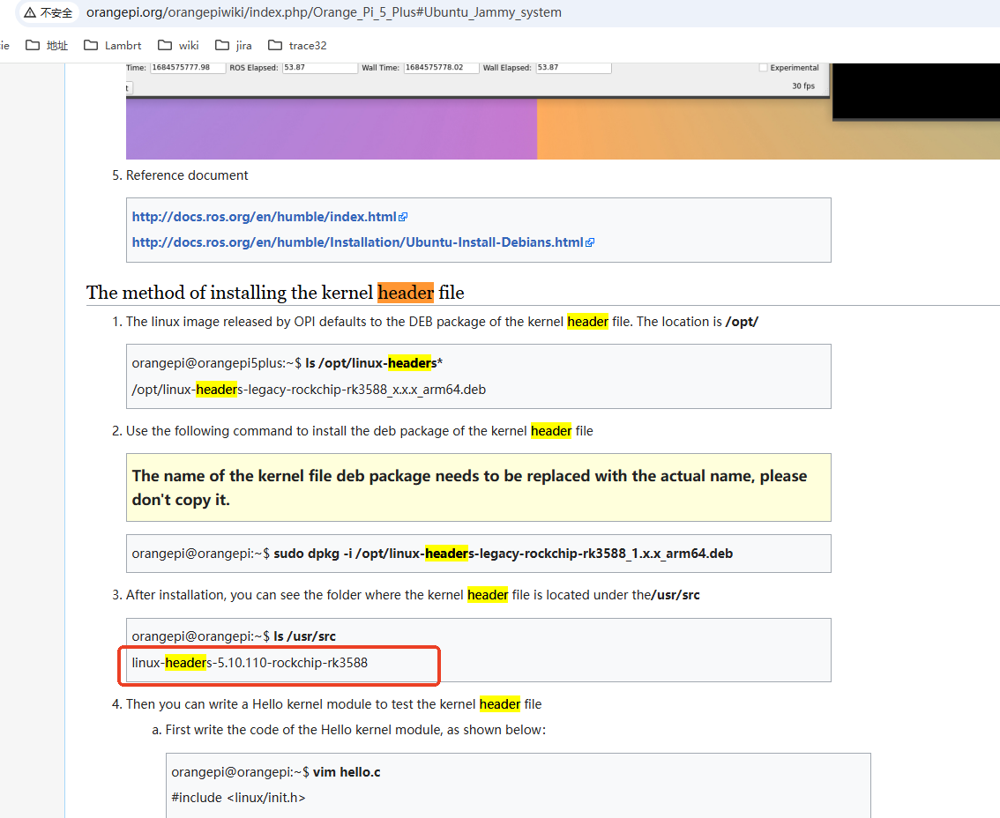

# AXCL FAQ

## 抓取设备侧日志

**axcl_smi** 工具支持将设备侧的日志（内核和SDK的syslog，运行时库日志）抓取到Host本地，使用方法如下：

```bash
  ./axcl_smi COMMAND {OPTIONS}

  OPTIONS:

      commands
        log                               dump log from slave
      arguments for <log> command
        -d[device], --device=[device]     device, default 0
        -t[type], --type=[type]           type: -1: all, bit mask: 0x01: daemon;
                                          0x02: worker; 0x10: syslog; 0x20:
                                          kernel
        -o[output], --output=[output]     output
```

示例如下：

```bash
/opt/bin/axcl # ./axcl_smi log -t -1
command is log
log type is -1
[11-08 20:36:34:240][E][axcl_smi][main][ 117]: device id: 129
[2024-11-08 20:36:34.474][942][C][control][dump][60]: log dump finished: ./log_20241108203634.tar.gz
```

## 调整运行时库日志级别

- Host的AXCL日志默认路径: `/tmp/axcl/axcl_logs.txt`，Device侧的日志默认路径：`/opt/data/axclLog`

- Host和Device侧的AXCL 运行时库日志级别默认为`info`等级，支持通过json文件和API配置。

  - json格式

    ```
    {
    	"log": {
    		"host": {
    			"path": "/tmp/axcl/axcl_logs.txt",
    			"//   ": "0: trace, 1: debug, 2: info, 3: warn, 4: error, 5: critical, 6: off",
    			"level": 2
    		},
    		"device": {
    			"//   ": "0: trace, 1: debug, 2: info, 3: warn, 4: error, 5: critical, 6: off",
    			"level": 2
    		}
    	}
    }
    ```

    调用`axclInit`接口时，传入json的文件路径生效。

    ```c
    axclError ret = axclInit("./axcl.json");
    ```

  - `axclSetLogLevel`接口更改Host的运行时库日志

    ```c
    axclSetLogLevel(3);
    ```

  :::{Note}
  json文件支持更改Host侧的日志存放路径，日志级别以及Device侧的日志级别，而`axclSetLogLevel`接口只能动态更改Host侧的日志级别。
  :::


## 调整PCIe传输DMA内存大小

AXCL运行时库(`libaxcl_rt.so`) PCIe传输DMA内存从CMA分配，对每个进程需要3块`dma buf size`的内存，即总大小 = **3 x `dma buf size`** Bytes。

默认`dma buf size`大小为4MBytes，支持通过axcl.json配置，调用`axclInit`接口生效, json格式如下：

```json
{
	"log": {
		"host": {
			"path": "/tmp/axcl/axcl_logs.txt",
			"//   ": "0: trace, 1: debug, 2: info, 3: warn, 4: error, 5: critical, 6: off",
			"level": 2
		},
		"device": {
			"//   ": "0: trace, 1: debug, 2: info, 3: warn, 4: error, 5: critical, 6: off",
			"level": 2
		}
	},
    "dma buf size": "0x200000"
}
```

如上所示，将`dma buf size`调整为2MBytes。

:::{Note}

- 应用根据实际业务需求和内存容量更改该参数，**最小大小为1MBytes**(0x100000)。
- `dma buf size` **同时**修改Host和Device的PCIe CMA缓存分配。

:::


## 调整 sysdump 时间戳

在 sysdump 后，sysdump 文件名时间戳可能不对，需要进行以下设置:

- 确认 RTC 是否设置为本地时区：

  使用以下命令检查 RTC 是否设置为本地时区：`timedatectl | grep RTC`

- 将 RTC 设置为本地时区：

  使用以下命令将 RTC 设置为本地时区：`sudo timedatectl set-local-rtc 1`

- 同步系统时间到 RTC：

  如果需要，您可以将系统时间同步到 RTC：`sudo hwclock --systohc`

## 驱动安装

### deb

#### 缺少 linux-header

deb 安装时可能出现以下安装失败信息，一般导致安装失败原因是缺少linux-header-$(uname -r) 目录文件，导致安装时pcie driver 编译失败



安装失败后，会有安装文件保存，进入到/usr/src/axcl/drv/pcie/driver 手动编译确认是否编译有问题，

:::{Note}

```bash
# 主控芯片是x86架构的编译方法
make host=x86 clean all install
# 主控芯片是arm64架构的编译方法
make host=arm64 clean all install
```

:::

或者查看/usr/src/axcl 目录下是否有out 目录确认编译是否有问题，如下：



- arm开发板： linux-header-$(uname -r) 一般由开发板厂商提供，可以去厂商官网查找说明，如下:



- x86 pc：linux-header-$(uname -r) 可以通过apt 下载，sudo apt install kernel-headers-$(uname -r)

:::{Note}

如果第一次安装失败，如果不把第一次安装的残留文件清除，可能会导致后面的安装失败，清除步骤如下：

```bash
sudo rm -rf /var/lib/dpkg/info/axclhost.*
sudo rm dpkg -r axclhost
```

:::

## 设备内存布局

### AX650N

```
 0x100000000 
      |          Linux OS           |   ramdisk   |                    CMM                    |
```

- **DDR地址起始地址**：0x100000000

- **ramdisk**

  - **分区大小** （`rootfs/card/Makefile`）：

    ```bash
    $(HOME_PATH)/tools/mkext4fs/make_ext4fs -l 128M $(BUILD_PATH)/out/$(PROJECT)/images/rootfs.ext4 $(BUILD_ROOT_DIR)/rootfs
    $(HOME_PATH)/tools/mkext4fs/make_ext4fs -l 128M -s $(BUILD_PATH)/out/$(PROJECT)/images/rootfs_sparse.ext4 $(BUILD_ROOT_DIR)/rootfs
    ```

  - **内核DTS ramdisk配置 **  (`kernel/linux/linux-5.15.73/arch/arm64/boot/dts/axera/AX650_card.dts`)

| 字段 | 说明                                                         | 示例                                                         |
| ---- | ------------------------------------------------------------ | ------------------------------------------------------------ |
| reg  | <起始地址高32位   起始地址低32位     大小高32位   大小低32位> | `<0x1 0x40000000 0x0 0x8000000>`<br />起始地址0x140000000,  大小 0x8000000 (128MB) |
| addr | <起始地址高32位   起始地址低32位>                            | `<0x1 0x40000000>`  起始地址0x140000000                      |
| size | <大小高32位   大小低32位>                                    | `<0x0 0x8000000>` 大小 0x8000000 (128MB)                     |

- **子卡固件rootfs的下载地址** (`tools/mkaxp/AX650X_card_pac.xml`)
  Base: ramdisk的地址

  ```
  
  			<ID>ROOTFS</ID>
  			<Type>CODE</Type>
  			<Block>
  				<Base>0x140000000</Base>
  				<Size>0x0</Size>
  			</Block>
  			<File>rootfs.ext4</File>
  			<Auth algo="0" />
  			<Description>Download ROOTFS image file</Description>
  </Img>
  ```

- **Makefile** (`build/projects/AX650_card.mak`)
  - **OS_MEM**:  OS+ramdisk的总大小
  - **CMM_POOL_PARAM**： CMM的partiton分区名；flag（= 0）；起始地址；partition总大小。 其中起始地址 = LinuxOS + ramdisk的偏移地址

#### 4+4 8G推荐配置

| Linux OS | ramdisk |  CMM   |
| :------: | :-----: | :----: |
|  1024MB  |  128MB  | 7040MB |

```
kernel/linux/linux-5.15.73/arch/arm64/boot/dts/axera/AX650_card.dts：
		ramdisk_mem@140000000 {
			compatible = "axera, ramdisk";
			reg = <0x1 0x40000000 0x0 0x8000000>;
			addr = <0x1 0x40000000>;
			size = <0x0 0x8000000>;
			no-map;
		};
		
build/projects/AX650_card.mak：
# OS:RAMDISK:CMM
OS_MEM         := mem=1152M
# cmm memory config
CMM_POOL_PARAM := anonymous,0,0x148000000,7040M

tools/mkaxp/AX650X_card_pac.xml：
		
			<ID>ROOTFS</ID>
			<Type>CODE</Type>
			<Block>
				<Base>0x140000000</Base>
				<Size>0x0</Size>
			</Block>
			<File>rootfs.ext4</File>
			<Auth algo="0" />
			<Description>Download ROOTFS image file</Description>
		</Img>
```

#### 2+2 4G推荐配置

| Linux OS | ramdisk |  CMM   |
| :------: | :-----: | :----: |
|  1024MB  |  128MB  | 2944MB |

```
kernel/linux/linux-5.15.73/arch/arm64/boot/dts/axera/AX650_card.dts：
		ramdisk_mem@140000000 {
			compatible = "axera, ramdisk";
			reg = <0x1 0x40000000 0x0 0x8000000>;
			addr = <0x1 0x40000000>;
			size = <0x0 0x8000000>;
			no-map;
		};
		
build/projects/AX650_card.mak：
# OS:RAMDISK:CMM
OS_MEM         := mem=1152M
# cmm memory config
CMM_POOL_PARAM := anonymous,0,0x148000000,2944M

tools/mkaxp/AX650X_card_pac.xml：
		
			<ID>ROOTFS</ID>
			<Type>CODE</Type>
			<Block>
				<Base>0x140000000</Base>
				<Size>0x0</Size>
			</Block>
			<File>rootfs.ext4</File>
			<Auth algo="0" />
			<Description>Download ROOTFS image file</Description>
		</Img>
```

## SDK 编译

### HOST

   cd 进入目标文件夹，比如sample

- x86_x64:  `make host=x86 clean && make host=x86 all install -j128`

- arm64    : `make host=arm64 clean && make host=arm64 all install -j128`

- ax650N :  `make clean && make all install -j128`

- 编译输出路径：

  ```bash
  /axcl/out$ tree -L 1
  .
  ├── axcl_linux_arm64
  ├── axcl_linux_ax650
  └── axcl_linux_x86
  ```

  

   **PCIe drvier 编译示例**:

```bash
root@axcnshbussrv06p:~/customer/AX650_SDK_V2.18.0_20241202130208_NO4477/axcl/drv$ make host=x86 clean && make host=x86 all install -j128
In subdir pcie... 
make[1]: Entering directory '/home/root/customer/AX650_SDK_V2.18.0_20241202130208_NO4477/axcl/drv/pcie'
In subdir driver...
... ...
In subdir host_dev ... 
make[3]: Entering directory '/home/root/customer/AX650_SDK_V2.18.0_20241202130208_NO4477/axcl/drv/pcie/driver/host_dev'
make ARCH=x86 CROSS_COMPILE= KCFLAGS="-DIS_THIRD_PARTY_PLATFORM" -C /lib/modules/5.4.0-150-generic/build M=/home/root/customer/AX650_SDK_V2.18.0_20241202130208_NO4477/axcl/build/out/axcl_linux_x86/objs/drv/pcie/driver/host_dev src=/home/root/customer/AX650_SDK_V2.18.0_20241202130208_NO4477/axcl/drv/pcie/driver/host_dev O=/lib/modules/5.4.0-150-generic/build  HOME_PATH=/home/root/customer/AX650_SDK_V2.18.0_20241202130208_NO4477 modules
make[4]: Entering directory '/usr/src/linux-headers-5.4.0-150-generic'
  CC [M]  /home/root/customer/AX650_SDK_V2.18.0_20241202130208_NO4477/axcl/build/out/axcl_linux_x86/objs/drv/pcie/driver/host_dev/ax_pcie_dev_host.o
  CC [M]  /home/root/customer/AX650_SDK_V2.18.0_20241202130208_NO4477/axcl/build/out/axcl_linux_x86/objs/drv/pcie/driver/host_dev/ax_pcie_opt.o
  CC [M]  /home/root/customer/AX650_SDK_V2.18.0_20241202130208_NO4477/axcl/build/out/axcl_linux_x86/objs/drv/pcie/driver/host_dev/ax_pcie_proc.o
  CC [M]  /home/root/customer/AX650_SDK_V2.18.0_20241202130208_NO4477/axcl/build/out/axcl_linux_x86/objs/drv/pcie/driver/host_dev/ax_pcie_msg_transfer.o
  CC [M]  /home/root/customer/AX650_SDK_V2.18.0_20241202130208_NO4477/axcl/build/out/axcl_linux_x86/objs/drv/pcie/driver/host_dev/version.o
  LD [M]  /home/root/customer/AX650_SDK_V2.18.0_20241202130208_NO4477/axcl/build/out/axcl_linux_x86/objs/drv/pcie/driver/host_dev/ax_pcie_host_dev.o
  Building modules, stage 2.
  MODPOST 1 modules
  CC [M]
```

**sample编译示例：**

```bash
root@axcnshbussrv06p:~/customer/AX650_SDK_V2.18.0_20241202130208_NO4477/axcl/sample$ make host=x86 clean && make host=x86 all install -j128
In subdir runtime... 
make[1]: Entering directory '/home/root/customer/AX650_SDK_V2.18.0_20241202130208_NO4477/axcl/sample/runtime'
make[1]: Leaving directory '/home/root/customer/AX650_SDK_V2.18.0_20241202130208_NO4477/axcl/sample/runtime'

... ...

In subdir transcode... 
make[2]: Entering directory '/home/root/customer/AX650_SDK_V2.18.0_20241202130208_NO4477/axcl/sample/ppl/transcode'
 INSTALL   /home/root/customer/AX650_SDK_V2.18.0_20241202130208_NO4477/axcl/build/out/axcl_linux_x86/objs/sample/ppl/transcode/axcl_sample_transcode launch_transcode.sh to /home/root/customer/AX650_SDK_V2.18.0_20241202130208_NO4477/axcl/out/axcl_linux_x86/bin/ 
make[2]: Leaving directory '/home/root/customer/AX650_SDK_V2.18.0_20241202130208_NO4477/axcl/sample/ppl/transcode'

Install /home/root/customer/AX650_SDK_V2.18.0_20241202130208_NO4477/axcl/sample/ppl success!!
 
make[1]: Leaving directory '/home/root/customer/AX650_SDK_V2.18.0_20241202130208_NO4477/axcl/sample/ppl'

In subdir x86app... 
make[1]: Entering directory '/home/root/customer/AX650_SDK_V2.18.0_20241202130208_NO4477/axcl/sample/x86app'
 INSTALL   /home/root/customer/AX650_SDK_V2.18.0_20241202130208_NO4477/axcl/build/out/axcl_linux_x86/objs/sample/x86app/axcl_demo /home/root/customer/AX650_SDK_V2.18.0_20241202130208_NO4477/axcl/sample/x86app/bin/* to /home/root/customer/AX650_SDK_V2.18.0_20241202130208_NO4477/axcl/out/axcl_linux_x86/bin/axcl_demo 
make[1]: Leaving directory '/home/root/customer/AX650_SDK_V2.18.0_20241202130208_NO4477/axcl/sample/x86app'

Install /home/root/customer/AX650_SDK_V2.18.0_20241202130208_NO4477/axcl/sample success!!
```

### DEVICE

1.  `cd build`  进入SDK根目录下的build目录，注意不是axcl/build
2.  `make p=AX650_card clean all install -j128`
3. deb, rpm生成路径：`build/out`
