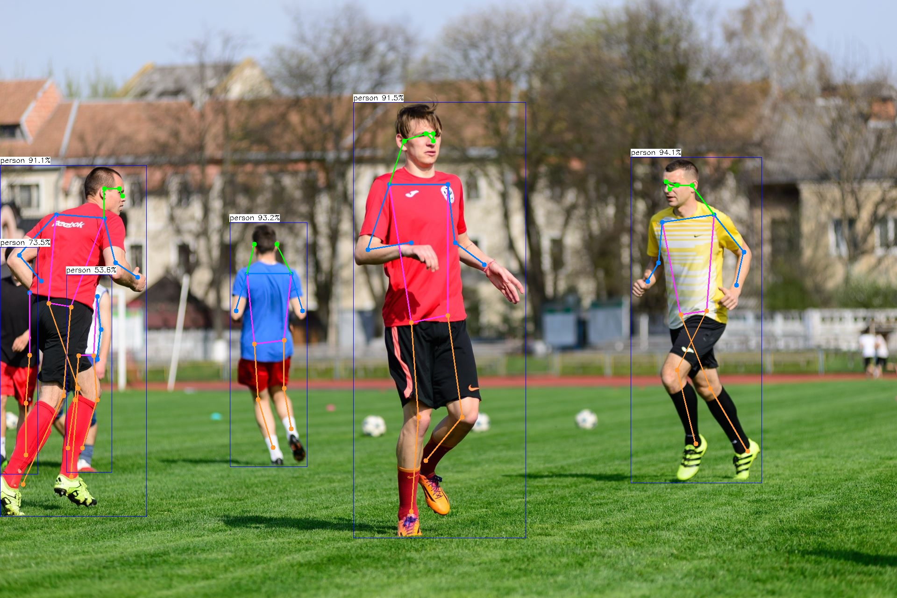
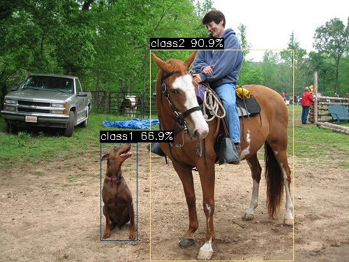

# AXCL NPU 示例

## AXCL-Samples

AXCL-Samples 由 爱芯元智 主导开发。该项目实现了常见的深度学习开源算法在基于 爱芯元智 的 SoC 实现的 PCIE算力卡 产品上的运行的示例代码，方便社区开发者进行快速评估和适配。

- [axcl-samples](https://github.com/AXERA-TECH/axcl-samples)；
- 该仓库采用最简单的方式展示常用的开源模型，例如 Ultralytics 的 YOLO 系列，DepthAnything，YOLO-Worldv2 等等。

### 编译

#### 下载项目

```
git clone https://github.com/AXERA-TECH/axcl-samples.git
cd axcl-samples
```

#### 安装编译依赖工具

```
sudo apt update
sudo apt install build-essential cmake libopencv-dev 
```

#### 编译

```
mkdir build && cd build
cmake ..
make install -j4
```

编译完成后在 `./install/bin` 下生成相关示例程序

```
axera@raspberrypi:~/samples/axcl-samples/build$ tree install
install
└── bin
    ├── axcl_classification
    ├── axcl_depth_anything
    ├── axcl_yolo11
    ├── axcl_yolo11_pose
    ├── axcl_yolo11_seg
    ├── axcl_yolov10
    ├── axcl_yolov10_u
    ├── axcl_yolov5_face
    ├── axcl_yolov5s
    ├── axcl_yolov5s_seg
    ├── axcl_yolov7_face
    ├── axcl_yolov8
    ├── axcl_yolov8_pose
    ├── axcl_yolov8_seg
    ├── axcl_yolov9
    ├── axcl_yolov9_u
    └── axcl_yolo_world_open_vocabulary
```

### ModelZoo

文档中说明的这几个预编译模型获取方式如下，更多预编译模型请见 [huggingface.co/AXERA-TECH](https://huggingface.co/AXERA-TECH)

| Models          | Huggingface                                                  |
| --------------- | ------------------------------------------------------------ |
| YOLO11X         | [Download](https://huggingface.co/AXERA-TECH/YOLO11/resolve/main/ax650/yolo11x.axmodel?download=true) |
| YOLO11X-Seg     | [Download](https://huggingface.co/AXERA-TECH/YOLO11-Seg/resolve/main/ax650/yolo11x-seg.axmodel?download=true) |
| YOLO11X-Pose    | [Download](https://huggingface.co/AXERA-TECH/YOLO11-Pose/resolve/main/ax650/yolo11x-pose.axmodel?download=true) |
| YOLOv7-Face     | [Download](https://huggingface.co/AXERA-TECH/YOLOv7-Face/resolve/main/ax650/yolov7-face.axmodel?download=true) |

### YOLO11x

基于 Ultralytics YOLO11 系列模型详细的模型导出、量化、编译的流程请参考[《基于 AX650N 部署 YOLO11》](https://zhuanlan.zhihu.com/p/772269394)

```
(base) axera@raspberrypi:~/temp $ ./axcl_yolo11 -i ssd_horse.jpg -m yolo11x.axmodel
--------------------------------------
model file : yolo11x.axmodel
image file : ssd_horse.jpg
img_h, img_w : 640 640
--------------------------------------
post process cost time:1.44 ms
--------------------------------------
Repeat 1 times, avg time 24.69 ms, max_time 24.69 ms, min_time 24.69 ms
--------------------------------------
detection num: 6
17:  96%, [ 216,   71,  423,  370], horse
16:  93%, [ 144,  203,  196,  345], dog
 0:  89%, [ 273,   14,  349,  231], person
 2:  88%, [   1,  105,  132,  197], car
 0:  82%, [ 431,  124,  451,  178], person
19:  46%, [ 171,  137,  202,  169], cow
--------------------------------------
```


### YOLO11x-Seg

```
(base) axera@raspberrypi:~/temp $ ./axcl_yolo11_seg -i ssd_horse.jpg -m yolo11x-seg.axmodel
--------------------------------------
model file : yolo11x-seg.axmodel
image file : ssd_horse.jpg
img_h, img_w : 640 640
--------------------------------------
post process cost time:3.12 ms
--------------------------------------
Repeat 1 times, avg time 34.75 ms, max_time 34.75 ms, min_time 34.75 ms
--------------------------------------
detection num: 6
17:  96%, [ 216,   71,  423,  370], horse
16:  93%, [ 144,  203,  196,  345], dog
 0:  89%, [ 273,   14,  349,  231], person
 2:  88%, [   1,  105,  132,  197], car
 0:  82%, [ 431,  124,  451,  178], person
19:  46%, [ 171,  137,  202,  169], cow
--------------------------------------
```


### YOLO11x-Pose

```
axera@raspberrypi:~/temp $ ./axcl_yolo11_pose -i football.jpg -m yolo11x-pose.axmodel
--------------------------------------
model file : yolo11x-pose.axmodel
image file : football.jpg
img_h, img_w : 640 640
--------------------------------------
post process cost time:0.59 ms
--------------------------------------
Repeat 1 times, avg time 25.02 ms, max_time 25.02 ms, min_time 25.02 ms
--------------------------------------
detection num: 6
 0:  94%, [1350,  337, 1632, 1036], person
 0:  93%, [ 492,  477,  658, 1000], person
 0:  92%, [ 756,  219, 1126, 1154], person
 0:  91%, [   0,  354,  314, 1108], person
 0:  73%, [   0,  530,   81, 1017], person
 0:  54%, [ 142,  589,  239, 1013], person
--------------------------------------
```


### YOLO World v2

YOLO-Worldv2 该模型的详细模型导出、量化、编译的流程请参考[《再谈 YOLO World 部署》](https://zhuanlan.zhihu.com/p/721856217)，

- [Huggingface](https://huggingface.co/AXERA-TECH/YOLO-World-V2)
- 模型：yoloworldv2_4cls_50_npu3.axmodel
- 输入图片：ssd_horse.jpg
- 输入文本：dog.bin, 对应的 4 分类 'dog' 'horse' 'sheep' 'cow'

```
axera@raspberrypi:~/temp $ ./axcl_yolo_world_open_vocabulary -m yoloworldv2_4cls_50_npu3.axmodel -t dog.bin -i ssd_horse.jpg
--------------------------------------
model file : yoloworldv2_4cls_50_npu3.axmodel
image file : ssd_horse.jpg
text_feature file : dog.bin
img_h, img_w : 640 640
--------------------------------------
post process cost time:0.35 ms
--------------------------------------
Repeat 1 times, avg time 4.47 ms, max_time 4.47 ms, min_time 4.47 ms
--------------------------------------
detection num: 2
 1:  91%, [ 215,   71,  421,  374], class2
 0:  67%, [ 144,  204,  197,  346], class1
--------------------------------------
```


### YOLOv7-Face

```
axera@raspberrypi:~/temp $ ./axcl_yolov7_face -m yolov7-face.axmodel -i selfie.jpg
--------------------------------------
model file : yolov7-face.axmodel
image file : selfie.jpg
img_h, img_w : 640 640
--------------------------------------
post process cost time:8.28 ms
--------------------------------------
Repeat 1 times, avg time 12.17 ms, max_time 12.17 ms, min_time 12.17 ms
--------------------------------------
detection num: 277
 0:  91%, [1137,  869, 1283, 1065], face
 0:  91%, [1424,  753, 1570,  949], face
......
 0:  20%, [1120,  570, 1145,  604], face
 0:  20%, [1025,  390, 1041,  413], face
```


## DepthAnythingv2

DepthAnythingv2 是常见的单目深度算法模型，基于该模型，我们展示 axcl npu python api 的使用。

DepthAnythingv2 该模型的详细模型导出、量化、编译的流程请参考[《基于 AX650N 的 Depth Anything v2》](https://github.com/AXERA-TECH/DepthAnythingV2.axera/tree/main/model_convert)

### 下载项目

```
git clone https://huggingface.co/AXERA-TECH/Depth-Anything-V2
```

### 安装必要的 python 环境

安装 axcl npu python 库

```
wget https://github.com/AXERA-TECH/pyaxengine/releases/download/0.1.1rc0/axengine-0.1.1-py3-none-any.whl
pip install axengine-0.1.1-py3-none-any.whl
```

安装其他 python 依赖

```
cd Depth-Anything-V2
pip install -r python/requirements.txt
```

### 运行

```
axera@raspberrypi:~/Depth-Anything-V2$ python python/infer.py --img examples/demo01.jpg --model depth_anything_v2_vits_ax650.axmodel
[INFO] Available providers:  ['AXCLRTExecutionProvider']
[INFO] Using provider: AXCLRTExecutionProvider
[INFO] SOC Name: AX650N
[INFO] VNPU type: VNPUType.DISABLED
[INFO] Compiler version: 3.3 ae03a08f
-------------
```


## LLM 示例

- 模型转请参考[大模型编译文档](https://pulsar2-docs.readthedocs.io/zh-cn/latest/appendix/build_llm.html)
- 更多示例请参考[Huggingface](https://huggingface.co/AXERA-TECH)

### Tokenizer 解析器

**tokenizer 解析准备**

为了更方便、更准确的进行 LLM DEMO 展示，我们采用 transformers 内置的 tokenizer 解析服务，因此需要安装 python 环境和 transformers 库

安装 miniconda

```
wget https://repo.anaconda.com/miniconda/Miniconda3-latest-Linux-aarch64.sh
chmod a+x Miniconda3-latest-Linux-aarch64.sh
./Miniconda3-latest-Linux-aarch64.sh
```

启用 python 环境

```
conda create --name axcl python=3.10
conda activate axcl
```

安装 transformers

```
pip install transformers==4.41.1 -i https://mirrors.aliyun.com/pypi/simple
```


### Qwen2.5-1.5B

- 支持较长的上下文，2.5k
- 支持 System Prompt 缓存
- 支持 prefill 优化

以上优化功能，最终都会惠及到所有的 LLM、VLM 模型上，可以简单理解为这个示例是尝鲜版本……

拷贝相关文件到树莓派5上

- 模型文件获取 [Huggingface](https://huggingface.co/AXERA-TECH/Qwen2.5-1.5B-Instruct-CTX-Int8)

**文件说明**

```
(axcl) axera@raspberrypi:~/samples/Qwen2.5-1.5B-Instruct-CTX-Int8 $ tree -L 1
.
├── kvcache
├── main
├── main_axcl_aarch64
├── main_axcl_x86
├── post_config.json
├── qwen2.5-1.5b-ctx-ax650
├── qwen2.5_tokenizer
├── qwen2.5_tokenizer_uid.py
├── run_qwen2.5_1.5b_ctx_ax650.sh
├── run_qwen2.5_1.5b_ctx_axcl_aarch64.sh
└── run_qwen2.5_1.5b_ctx_axcl_x86.sh
```

**启动 tokenizer 解析器**

```
(axcl) axera@raspberrypi:~/samples/Qwen2.5-1.5B-Instruct-CTX-Int8 $ python qwen2.5_tokenizer_uid.py
Server running at http://0.0.0.0:12345
```

**System prompt cache**

- The System prompt can be preset through the configuration file from `--system_prompt`
- The System prompt can be cached in the form of kv cache to a specified folder for quick loading at the next run time from `--kvcache_path`
- This folder needs to be created manually before running, for example `mkdir kvcache`

```
(base) axera@raspberrypi:~/samples/qwen2.5-1.5b-ctx $ cat run_qwen2.5_1.5b_ctx_axcl_aarch64.sh
./main_axcl_aarch64 \
--system_prompt "你的名字叫小智（allen）,你是一个人畜无害的AI助手。深圳市今天（4月1日）阴天，愚人节，气温在14°C至19°C之间，微风。" \
--kvcache_path "./kvcache" \
--template_filename_axmodel "qwen2.5-1.5b-ctx-ax650/qwen2_p128_l%d_together.axmodel" \
--axmodel_num 28 \
--tokenizer_type 2 \
--url_tokenizer_model "http://127.0.0.1:12345" \
--filename_post_axmodel "qwen2.5-1.5b-ctx-ax650/qwen2_post.axmodel" \
--filename_tokens_embed "qwen2.5-1.5b-ctx-ax650/model.embed_tokens.weight.bfloat16.bin" \
--tokens_embed_num 151936 \
--tokens_embed_size 1536 \
--use_mmap_load_embed 1 \
--live_print 1 \
--devices 0
```

#### Inference with M.2 Accelerator card

[What is M.2 Accelerator card?](https://axcl-pi5-examples-cn.readthedocs.io/zh-cn/latest/index.html), Show this DEMO based on Raspberry PI 5.

```
(base) axera@raspberrypi:~/samples/Qwen2.5-1.5B-Instruct-CTX-Int8 $ mkdir -p kvcache
(base) axera@raspberrypi:~/samples/Qwen2.5-1.5B-Instruct-CTX-Int8 $ ./run_qwen2.5_1.5b_ctx_axcl_aarch64.sh
[I][                            Init][ 134]: LLM init start
[I][                            Init][  41]: connect http://127.0.0.1:12345 ok
bos_id: -1, eos_id: 151645
  3% | ██                                |   1 /  31 [0.46s<14.11s, 2.20 count/s] tokenizer init ok
[I][                            Init][  45]: LLaMaEmbedSelector use mmap
  6% | ███                               |   2 /  31 [0.46s<7.05s, 4.40 count/s] embed_selector init ok
[I][                             run][  30]: AXCLWorker start with devid 0
100% | ████████████████████████████████ |  31 /  31 [29.18s<29.18s, 1.06 count/s] init post axmodel ok,remain_cmm(-1 MB)m(-1 MB)
[I][                            Init][ 235]: max_token_len : 2559
[I][                            Init][ 238]: kv_cache_size : 256, kv_cache_num: 2559
[I][                            Init][ 246]: prefill_token_num : 128
[I][                            Init][ 250]: grp: 1, prefill_max_token_num : 1
[I][                            Init][ 250]: grp: 2, prefill_max_token_num : 512
[I][                            Init][ 250]: grp: 3, prefill_max_token_num : 1024
[I][                            Init][ 250]: grp: 4, prefill_max_token_num : 1536
[I][                            Init][ 250]: grp: 5, prefill_max_token_num : 2048
________________________
|    ID| remain cmm(MB)|
========================
|     0|             -1|
¯¯¯¯¯¯¯¯¯¯¯¯¯¯¯¯¯¯¯¯¯¯¯¯
[I][                     load_config][ 282]: load config:
{
    "enable_repetition_penalty": false,
    "enable_temperature": true,
    "enable_top_k_sampling": true,
    "enable_top_p_sampling": false,
    "penalty_window": 20,
    "repetition_penalty": 1.2,
    "temperature": 0.9,
    "top_k": 10,
    "top_p": 0.8
}

[I][                            Init][ 275]: LLM init ok
Type "q" to exit, Ctrl+c to stop current running
[E][                    load_kvcache][ 100]: k_cache ./kvcache/k_cache_0.bin or v_cache ./kvcache/v_cache_0.bin not exist
[W][                            main][ 223]: load kvcache from path: ./kvcache failed,generate kvcache
100% | ████████████████████████████████ |  53 /  53 [5.06s<5.06s, 10.47 token/s]
[I][                      GetKVCache][ 419]: precompute_len:53
[I][                            main][ 230]: generate kvcache to path: ./kvcache
[I][                            main][ 232]: precompute_len: 53
[I][                            main][ 233]: system_prompt: 你的名字叫小智（allen）,你是一个人畜无害的AI助手。深圳市今天（4月1日）阴天，愚人节，气温在14°C至19°C之间，微风。
prompt >> 你是谁
[I][                      SetKVCache][ 448]: prefill_grpid:2 kv_cache_num:512 precompute_len:53 input_num_token:10
[I][                             Run][ 722]: input token num : 10
[I][                             Run][ 823]: ttft: 548.23 ms
我是深圳市气象局发布的天气预报，我叫小智，是为了解答大家关于天气的问题而设计的。如果你对天气有疑问，欢迎随时询问！

[N][                             Run][ 975]: hit eos,avg 9.04 token/s

[I][                      GetKVCache][ 419]: precompute_len:98
prompt >> 你能干什么
[I][                      SetKVCache][ 448]: prefill_grpid:2 kv_cache_num:512 precompute_len:98 input_num_token:10
[I][                             Run][ 722]: input token num : 10
[I][                             Run][ 823]: ttft: 548.07 ms
我能回答关于天气、生活、科技、文化、娱乐、历史等方面的很多问题。如果你有任何想知道的内容，都可以问我哦！

[N][                             Run][ 975]: hit eos,avg 9.03 token/s

[I][                      GetKVCache][ 419]: precompute_len:135
prompt >> q
[I][                             run][  80]: AXCLWorker exit with devid 0


>> q

(base) axera@raspberrypi:~ $ axcl-smi
+------------------------------------------------------------------------------------------------+
| AXCL-SMI  V2.25.0_20250117163029                                Driver  V2.25.0_20250117163029 |
+-----------------------------------------+--------------+---------------------------------------+
| Card  Name                     Firmware | Bus-Id       |                          Memory-Usage |
| Fan   Temp                Pwr:Usage/Cap | CPU      NPU |                             CMM-Usage |
|=========================================+==============+=======================================|
|    0  AX650N                    V2.25.0 | 0000:01:00.0 |                188 MiB /      945 MiB |
|   --   37C                      -- / -- | 1%        0% |               2335 MiB /     7040 MiB |
+-----------------------------------------+--------------+---------------------------------------+

+------------------------------------------------------------------------------------------------+
| Processes:                                                                                     |
| Card      PID  Process Name                                                   NPU Memory Usage |
|================================================================================================|
|    0   147835  /home/axera/samples/qwen2.5-1.5b-ctx/main_axcl_aarch64               1990172 KiB |
+------------------------------------------------------------------------------------------------+
(base) axera@raspberrypi:~ $
```


### DeepSeek-R1-Distill-Qwen-1.5B

拷贝相关文件到树莓派5上

- 模型文件获取 [Huggingface](https://huggingface.co/AXERA-TECH/DeepSeek-R1-Distill-Qwen-1.5B-GPTQ-Int4)

**文件说明**

```
(base) axera@raspberrypi:~/samples/deepseek-1.5b-gptq-int4 $ tree
.
├── config.json
├── deepseek-r1-1.5b-gptq-int4-ax650
│   ├── model.embed_tokens.weight.bfloat16.bin
│   ├── qwen2_p128_l0_together.axmodel
......
│   ├── qwen2_p128_l8_together.axmodel
│   ├── qwen2_p128_l9_together.axmodel
│   └── qwen2_post.axmodel
├── deepseek-r1_tokenizer
│   ├── tokenizer_config.json
│   └── tokenizer.json
├── deepseek-r1_tokenizer.py
├── main_axcl_aarch64
├── main_axcl_x86
├── main_prefill
├── post_config.json
├── run_deepseek-r1_1.5b_gptq_int4_ax650.sh
├── run_deepseek-r1_1.5b_gptq_int4_axcl_aarch64.sh
└── run_deepseek-r1_1.5b_gptq_int4_axcl_x86.sh
```

**启动 tokenizer 解析器**

运行 tokenizer 服务，Host ip 默认为 localhost，端口号设置为 12345，正在运行后信息如下

```
(axcl) axera@raspberrypi:~/samples/deepseek-1.5b-gptq-int4 $ python deepseek-r1_tokenizer.py --port 12345
None of PyTorch, TensorFlow >= 2.0, or Flax have been found. Models won't be available and only tokenizers, configuration and file/data utilities can be used.
Special tokens have been added in the vocabulary, make sure the associated word embeddings are fine-tuned or trained.
151646 <｜begin▁of▁sentence｜> 151643 <｜end▁of▁sentence｜>
<｜begin▁of▁sentence｜>You are DeepSeek-R1, You are a helpful assistant.<｜User｜>hello world<｜Assistant｜>
[151646, 151646, 2610, 525, 18183, 39350, 10911, 16, 11, 1446, 525, 264, 10950, 17847, 13, 151644, 14990, 1879, 151645]
http://localhost:12345
```

**运行 DeepSeek-R1-1.5B**

```
(base) axera@raspberrypi:~/samples/deepseek-1.5b-gptq-int4 $ ./run_deepseek-r1_1.5b_gptq_int4_axcl_aarch64.sh
build time: Feb 13 2025 15:44:57
[I][                            Init][ 111]: LLM init start
bos_id: 151646, eos_id: 151643
100% | ████████████████████████████████ |  31 /  31 [21.03s<21.03s, 1.47 count/s] init post axmodel okremain_cmm(6219 MB)
[I][                            Init][ 226]: max_token_len : 1023
[I][                            Init][ 231]: kv_cache_size : 256, kv_cache_num: 1023
[I][                     load_config][ 282]: load config:
{
    "enable_repetition_penalty": false,
    "enable_temperature": true,
    "enable_top_k_sampling": true,
    "enable_top_p_sampling": false,
    "penalty_window": 20,
    "repetition_penalty": 1.2,
    "temperature": 0.9,
    "top_k": 10,
    "top_p": 0.8
}

[I][                            Init][ 288]: LLM init ok
Type "q" to exit, Ctrl+c to stop current running
>> who are you?
<think>
您好！我是由中国的深度求索（DeepSeek）公司开发的智能助手DeepSeek-R1。如您有任何任何问题，我会尽我所能为您提供帮助和答案。
</think>

您好！我是由中国的深度求索（DeepSeek）公司开发的智能助手DeepSeek-R1。如您有任何任何问题，我会尽我所能为您提供帮助和答案。

[N][                             Run][ 610]: hit eos,avg 14.46 token/s

>> 直角三角形两直角边是3和4，斜边是多少？简单思考
<think>
首先，我知道直角三角形的两条直角边分别为3和4。

根据勾股定理，斜边的长度可以通过公式√(3² + 4²)计算得到。

计算3的平方得到9，4的平方得到16，然后两者相加得到25。

接着，计算25的平方根，结果是5。

因此，斜边的长度是5。
</think>

要计算直角三角形的斜边长度，可以使用勾股定理。勾股定理指出，对于一个直角三角形，斜边的平方等于两条直角边的平方和。具体步骤如下：

1. **已知条件**：
   - 直角三角形的两条直角边分别为 3 和 4。

2. **勾股定理公式**：
   \[
   斜边 = \sqrt{a^2 + b^2}
   \]
   其中，\(a\) 和 \(b\) 是直角三角形的两条直角边。

3. **代入已知数值**：
   \[
   斜边 = \sqrt{3^2 + 4^2} = \sqrt{9 + 16} = \sqrt{25}
   \]

4. **计算结果**：
   \[
   斜边 = 5
   \]

**最终答案**：
\boxed{5}

[N][                             Run][ 610]: hit eos,avg 14.17 token/s

>> q

(base) axera@raspberrypi:~/samples/deepseek-1.5b-gptq-int4 $ 
```

## VLM 示例
### InternVL2_5-1B

InternVL2_5-1B 的详细模型导出、量化、编译的流程请参考[《基于 AX650N/AX630C 部署多模态大模型 InternVL2-1B》](https://zhuanlan.zhihu.com/p/4118849355)

拷贝相关文件到 Host 

- 模型文件获取 [Huggingface](https://huggingface.co/AXERA-TECH/InternVL2_5-1B)

**文件说明**

```
(axcl) axera@raspberrypi:~/samples/InternVL2_5-1B $ tree
.
├── config.json
├── internvl2_5_1b_448_ax650
│   ├── model.embed_tokens.weight.bfloat16.bin
│   ├── qwen2_p320_l0_together.axmodel
......
│   ├── qwen2_p320_l9_together.axmodel
│   ├── qwen2_post.axmodel
│   └── vit_intern_2_5_sim_space2depth_nhwc.axmodel
├── internvl2_5_tokenizer
│   ├── added_tokens.json
│   ├── merges.txt
│   ├── special_tokens_map.json
│   ├── tokenizer_config.json
│   └── vocab.json
├── internvl2_5_tokenizer_448.py
├── main_aarch64_axcl
├── run_internvl2_5_448_axcl_aarch64.sh
└── ssd_car.jpg
```

**启动 tokenizer 解析器**

安装 **tokenizer 解析器** 必要依赖请参考 `5.3.1. Tokenizer 解析器` 章节。

运行 tokenizer 服务，Host ip 默认为 localhost，端口号设置为 12345，正在运行后信息如下

```
(axcl) axera@raspberrypi:~/samples/InternVL2_5-1B $ python internvl2_5_tokenizer_448.py --port 12345
None None 151645 <|im_end|>
[151644, 8948, 198, 56568, 104625, 100633, 104455, 104800, 101101, 32022, 102022, 99602, 100013, 9370, 90286, 21287, 42140, 
53772, 35243, 26288, 104949, 3837, 105205, 109641, 67916, 30698, 11, 54851, 46944, 115404, 42192, 99441, 100623, 48692, 100168, 
110498, 1773, 151645, 151644, 872, 198, 151665, 151667, 151667, 151667, 151667, 151667, 151667, 151667, 151667, 
....
151667, 151667, 151667, 151667, 151667, 151667, 151667, 151667, 151667, 151667, 151667, 151667, 151667, 151667, 151667, 
151667, 151667, 151667, 151666, 198, 5501, 7512, 279, 2168, 19620, 13, 151645, 151644, 77091, 198]
310
[151644, 8948, 198, 56568, 104625, 100633, 104455, 104800, 101101, 32022, 102022, 99602, 100013, 9370, 90286, 
21287, 42140, 53772, 35243, 26288, 104949, 3837, 105205, 109641, 67916, 30698, 11, 54851, 46944, 115404, 
42192, 99441, 100623, 48692, 100168, 110498, 1773, 151645, 151644, 872, 198, 14990, 1879, 151645, 151644, 77091, 198]
47
http://0.0.0.0:12345
```

**运行 InternVL2.5-1B**

测试图片


输出信息

```
(base) axera@raspberrypi:~/samples/InternVL2_5-1B $ ./run_internvl2_5_448_axcl_aarch64.sh
[I][                            Init][ 128]: LLM init start
[I][                            Init][ 321]: connect http://127.0.0.1:12345 ok
bos_id: -1, eos_id: 151645
  7% | ███                               |   2 /  27 [0.13s<1.73s, 15.62 count/s] embed_selector init ok
[I][                             run][  30]: AXCLWorker start with devid 0
100% | ████████████████████████████████ |  27 /  27 [8.02s<8.02s, 3.37 count/s] init post axmodel ok,remain_cmm(-1 MB)
[I][                            Init][ 225]: image_encoder_height : 448, image_encoder_width: 448
[I][                            Init][ 227]: max_token_len : 1023
[I][                            Init][ 230]: kv_cache_size : 128, kv_cache_num: 1023
[I][                            Init][ 238]: prefill_token_num : 320
[I][                            Init][ 240]: prefill_max_token_num : 320
________________________
|    ID| remain cmm(MB)|
========================
|     0|             -1|
¯¯¯¯¯¯¯¯¯¯¯¯¯¯¯¯¯¯¯¯¯¯¯¯
[I][                            Init][ 337]: LLM init ok
Type "q" to exit, Ctrl+c to stop current running
prompt >> Describe the picture
image >> ssd_car.jpg
[I][                          Encode][ 393]: image encode time : 361.53 ms, size : 229376
[I][                          Encode][ 453]: offset : 42 out_embed.size() : 275072
[I][                             Run][ 481]: input token num : 307, prefill_split_num : 1
[I][                             Run][ 604]: ttft: 506.51 ms
The image depicts a scene on a city street with a prominent red double-decker bus in the background. 
The bus is adorned with an advertisement that reads, "THINGS GET MORE EXCITING WHEN YOU SAY YES." 
The bus is traveling on a road with a white bicycle lane marked on it. The street is lined with buildings, 
and there is a black car parked on the side of the road. A woman is standing in the foreground, smiling at the camera. 
She is wearing a black jacket and a scarf. The overall atmosphere suggests a typical urban setting, 
possibly in a city known for its iconic double-decker buses.

[N][                             Run][ 756]: hit eos,avg 20.50 token/s

prompt >> q
[I][                             run][  80]: AXCLWorker exit with devid 0
(base) axera@raspberrypi:~/samples/InternVL2_5-1B $ 
```

### Qwen2.5-VL-3B
(待补充)

## 生成式大模型

### StableDiffusionv1.5

拷贝相关文件到树莓派5上

- 模型文件获取 [Huggingface](https://huggingface.co/AXERA-TECH/lcm-lora-sdv1-5)

**文件说明**

```
(axcl) axera@raspberrypi:~/samples/lcm-lora-sdv1-5 $ tree -L 2
.
├── asserts
│   ├── img2img-init.png
│   ├── img2img_output_axe.png
│   ├── lcm_lora_sdv1_5_axmodel.png
│   ├── lcm_lora_sdv1-5_imgGrid_output.png
│   └── txt2img_output_axe.png
├── config.json.txt
├── Disclaimer.md
├── img2img_output_axe.png
├── lcm_lora_sdv1-5_imgGrid_output.png
├── LICENSE
├── model_convert
│   ├── config_unet_u16.json
│   ├── config_vae_decoder_u16.json
│   ├── config_vae_encoder_u16.json
│   ├── README.md
│   ├── requirements.txt
│   ├── sd15_export_onnx.py
│   └── sd15_lora_prepare_data.py
├── models
│   ├── img2img-init.png
│   ├── text_encoder
│   ├── time_input_img2img.npy
│   ├── time_input_txt2img.npy
│   ├── tokenizer
│   ├── unet.axmodel
│   ├── vae_decoder.axmodel
│   └── vae_encoder.axmodel
├── README.md
├── requirements.txt
├── run_img2img_axe_infer.py
├── run_img2img_onnx_infer.py
├── run_txt2img_axe_infer.py
├── run_txt2img_onnx_infer.py
└── txt2img_output_axe.png
```

**环境安装**

安装 axcl npu python 库

```
wget https://github.com/AXERA-TECH/pyaxengine/releases/download/0.1.1rc0/axengine-0.1.1-py3-none-any.whl
pip install axengine-0.1.1-py3-none-any.whl
```

安装其他 python 依赖

```
cd lcm-lora-sdv1-5
pip install -r python/requirements.txt
```

#### 文生图

- 运行 `run_txt2img_axe_infer.py`

**Input Prompt**

```
Self-portrait oil painting, a beautiful cyborg with golden hair, 8k
```

**Output**

```
(sd1_5) axera@raspberrypi:~/samples/lcm-lora-sdv1-5 $ python run_txt2img_axe_infer.py
[INFO] Available providers:  ['AXCLRTExecutionProvider']
prompt: Self-portrait oil painting, a beautiful cyborg with golden hair, 8k
text_tokenizer: ./models/tokenizer
text_encoder: ./models/text_encoder
unet_model: ./models/unet.axmodel
vae_decoder_model: ./models/vae_decoder.axmodel
time_input: ./models/time_input_txt2img.npy
save_dir: ./txt2img_output_axe.png
text encoder take 1877.4ms
[INFO] Using provider: AXCLRTExecutionProvider
[INFO] SOC Name: AX650N
[INFO] VNPU type: VNPUType.DISABLED
[INFO] Compiler version: 3.3 972f38ca
[INFO] Using provider: AXCLRTExecutionProvider
[INFO] SOC Name: AX650N
[INFO] VNPU type: VNPUType.DISABLED
[INFO] Compiler version: 3.3 972f38ca
load models take 14023.5ms
unet once take 437.7ms
unet once take 433.7ms
unet once take 433.5ms
unet once take 433.5ms
unet loop take 1741.6ms
vae inference take 913.9ms
save image take 170.0ms
(sd1_5) axera@raspberrypi:~/samples/lcm-lora-sdv1-5 $ 
```

**Output Image**


#### 图生图

- 运行 `run_txt2img_axe_infer.py`

**Input Prompt**

```
Astronauts in a jungle, cold color palette, muted colors, detailed, 8k
```

**Input Image**


**Output**

```
(sd1_5) axera@raspberrypi:~/samples/lcm-lora-sdv1-5 $ python run_img2img_axe_infer.py
[INFO] Available providers:  ['AXCLRTExecutionProvider']
prompt: Astronauts in a jungle, cold color palette, muted colors, detailed, 8k
text_tokenizer: ./models/tokenizer
text_encoder: ./models/text_encoder
unet_model: ./models/unet.axmodel
vae_encoder_model: ./models/vae_encoder.axmodel
vae_decoder_model: ./models/vae_decoder.axmodel
init image: ./models/img2img-init.png
time_input: ./models/time_input_img2img.npy
save_dir: ./img2img_output_axe.png
text encoder take 1741.5ms
[INFO] Using provider: AXCLRTExecutionProvider
[INFO] SOC Name: AX650N
[INFO] VNPU type: VNPUType.DISABLED
[INFO] Compiler version: 3.3-dirty 2ecead35-dirty
[INFO] Using provider: AXCLRTExecutionProvider
[INFO] SOC Name: AX650N
[INFO] VNPU type: VNPUType.DISABLED
[INFO] Compiler version: 3.3 972f38ca
[INFO] Using provider: AXCLRTExecutionProvider
[INFO] SOC Name: AX650N
[INFO] VNPU type: VNPUType.DISABLED
[INFO] Compiler version: 3.3 972f38ca
load models take 14768.5ms
vae encoder inference take 458.8ms
unet once take 433.4ms
unet once take 433.5ms
unet loop take 871.3ms
vae decoder inference take 914.0ms
grid image saved in ./lcm_lora_sdv1-5_imgGrid_output.png
save image take 428.7ms
(sd1_5) axera@raspberrypi:~/samples/lcm-lora-sdv1-5 $ 
```

**Output Image**


## 音频大模型

本章节展示常用的 ASR（自动语音识别）、TTS（文本转语音）模型示例。

### Whisper

- 本小节只指导如何在 Raspberry Pi 5 上运行预编译好的基于 Whipser Small 的语音转文字示例；
- 模型转换、示例源码编译请参考 [whisper.axcl](https://github.com/ml-inory/whisper.axcl)。

**下载**

```
git clone https://github.com/ml-inory/whisper.axcl.git
```

**预编译模型**

预编译模型下载

- [百度网盘](https://pan.baidu.com/s/1tOHVMZCin0A68T5HmKRJyg?pwd=axyz)
- [Huggingface](https://huggingface.co/AXERA-TECH/Whisper)

下载后放到 models 下  

**编译**

```
cd whisper.axcl
mkdir -p build && cd build
cmake -DCMAKE_INSTALL_PREFIX=../install -DCMAKE_BUILD_TYPE=Release ..
make install -j4
```

**运行 Whisper**

```
cd install
./whisper -w ../demo.wav
```

**运行结果**

```
(base) axera@raspberrypi:~/qtang/whisper.axcl/install $ ./whisper -w ../demo.wav
encoder: ../models/small-encoder.axmodel
decoder_main: ../models/small-decoder-main.axmodel
decoder_loop: ../models/small-decoder-loop.axmodel
wav_file: ../demo.wav
language: zh
Load encoder take 3336.25 ms
Load decoder_main take 6091.89 ms
Load decoder_loop take 5690.05 ms
Read positional_embedding
Encoder run take 190.26 ms
First token: 17556       take 51.49ms
Next Token: 20844        take 30.15 ms
Next Token: 7781         take 30.21 ms
Next Token: 20204        take 30.20 ms
Next Token: 28455        take 30.17 ms
Next Token: 31962        take 30.02 ms
Next Token: 6336         take 30.09 ms
Next Token: 254          take 30.22 ms
Next Token: 2930         take 30.14 ms
Next Token: 236          take 30.14 ms
Next Token: 36135        take 30.12 ms
Next Token: 15868        take 30.18 ms
Next Token: 252          take 30.01 ms
Next Token: 1546         take 30.17 ms
Next Token: 46514        take 30.17 ms
Next Token: 50257        take 30.15 ms
All Token: take 503.68ms, 31.77 token/s
All take 735.09ms
Result: 甚至出现交易几乎停滞的情况
(base) axera@raspberrypi:~/qtang/whisper.axcl/install $
```

### MeloTTS

- 本小节只指导如何在 Raspberry Pi 5 上运行预编译好的 MeloTTS 文字转语音示例；
- 模型转换、示例源码编译请参考 [melotts.axcl](https://github.com/ml-inory/melotts.axcl)。

**下载**

```
git clone https://github.com/ml-inory/melotts.axcl.git
```

**预编译模型**

```
cd melotts.axcl
./download_models.sh
```

**编译**

x86_64 平台
```
./build.sh
```

aarch64 平台
```
./build_aarch64.sh
```

**运行 MeloTTS**
在 melotts.axcl 项目根目录下运行
```
./install/melotts -s 句子
```

**运行结果**

```
(base) axera@raspberrypi:~/melotts.axcl $ ./install/melotts
encoder: ./models/encoder.onnx
decoder: ./models/decoder.axmodel
lexicon: ./models/lexicon.txt
token: ./models/tokens.txt
sentence: 爱芯元智半导体股份有限公司，致力于打造世界领先的人工智能感知与边缘计算芯片。服务智慧城市、智能驾驶、机器人的海量普惠的应用
wav: output.wav
speed: 0.800000
sample_rate: 44100
Load encoder
Load decoder model
Encoder run take 191.25ms
decoder slice num: 9
Decode slice(1/9) take 39.90ms
Decode slice(2/9) take 39.66ms
Decode slice(3/9) take 39.98ms
Decode slice(4/9) take 39.57ms
Decode slice(5/9) take 40.28ms
Decode slice(6/9) take 39.68ms
Decode slice(7/9) take 39.59ms
Decode slice(8/9) take 39.58ms
Decode slice(9/9) take 41.11ms
Saved audio to output.wav
(base) axera@raspberrypi:~/melotts.axcl $ 
```
