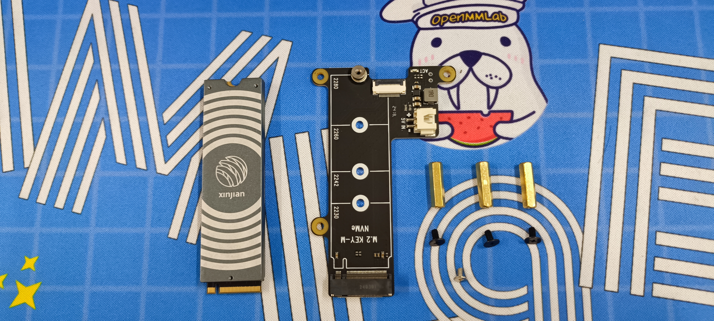
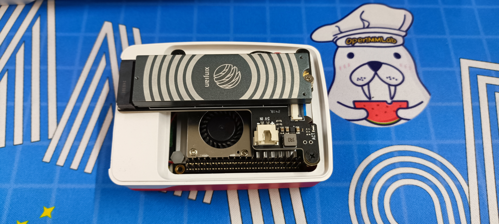
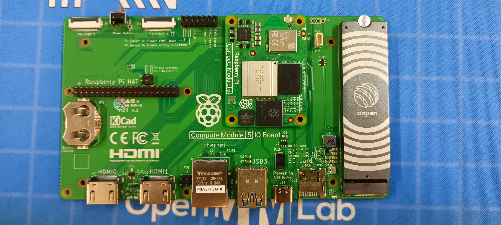

# AXCL 硬件安装

## M.2 算力卡

在树莓派 5 上安装 M.2 加速卡时，首先需要准备一块 M.2 HAT+ 扩展板。参考[官方链接](https://www.raspberrypi.com/news/using-m-2-hat-with-raspberry-pi-5/)，M.2 HAT+ 的官方版本只支持 2230、2242 的 M.2 M Key 卡，通常 AX650 加速卡是 2280 的，您可能需要考虑购买第三方的支持 2280 长度的 M.2 HAT+ [扩展板](https://e.tb.cn/h.6c1PhZz3yc90T42)。

如果是 CM5 的用户，建议直接使用 CM5 配套的 [Compute Module 5](https://www.raspberrypi.com/products/compute-module-5/?variant=cm5-104032)。

### 示意图

## HAT AI Module

(待补充)
