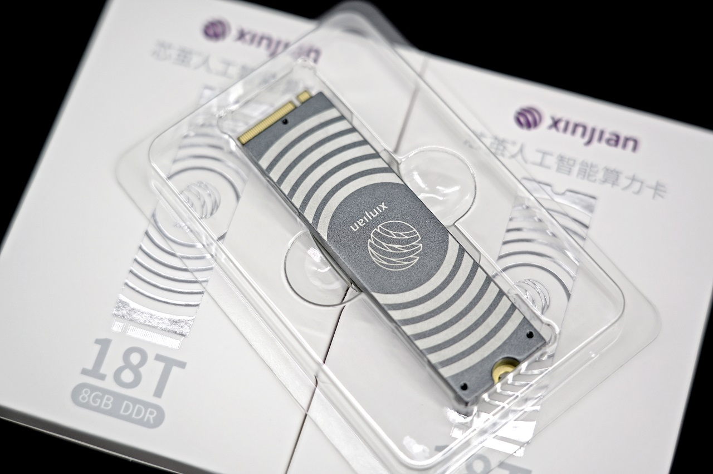

# AXCL RaspberryPi 5 Examples 简介

本项目针对 RaspberryPi 5 平台进行讲解，如何调用 [Axera](https://www.axera-tech.com/) 芯片设计的 PCIE 算力拓展板卡，增强 RaspberryPi 5 的 AI 应用功能。

已适配的AI算法

- 图像分类
  - ResNet、MobileNet、SwinT、ViT 等
- 目标检测
  - YOLO 等
- 物体分割
  - YOLO-Seg、SAM 等
- 深度估计
  - DepthAnythingv2、Metric3D、RAFT-Stereo
- 语音识别
  - Whisper、WeNet
- 语音合成
  - MeloTTS、OpenVoice
- 多模态
  - CLIP
- 大语言模型
  - DeepSeek-R1-Distill、Qwen2.5、InternML2、MiniCPM、Llama3.2、Gemma2、SmolLM2 等
- 多模态大语言模型
  - Qwen2.5-VL、InternVL2.5、MiniCPM-V、SmolVLM
- 生成式应用
  - StableDiffusionv1.5、LivePortrait

## 支持硬件板卡

### M.2 算力卡

- [淘宝](https://e.tb.cn/h.61qnhDn8E44ZmT7?tk=iy8keHNcliP)

|              | 描述                                                    |
| ------------ | ------------------------------------------------------- |
| 处理器       | Octa-corre Cortex-A55@1.7GHz                            |
| 内存         | 4/8/16GiB，64bit LPDDR4x                                     |
| 存储         | 16MiB，Nor Flash                                        |
| NPU           | 18TOPs@Int8，72TOPs@Int4                                |
|              | 支持 CNN、Transformer 模型部署，支持 LLM、VLM 部署      |
| 视频编码     | H.264/H.265，16路 1080@30fps 编码                       |
| 视频解码     | H.264/H.265，32路 1080@30fps 解码                       |
| 外形尺寸     | M.2 2280，M Key                                         |
| 工作电压     | 3.3 V                                                   |
| 整体系统功耗 | ＜8 w                                                   |

### HAT AI Module

- [淘宝]()
- [速卖通]()

|              | 描述                                                    |
| ------------ | ------------------------------------------------------- |
| 处理器       | Octa-corre Cortex-A55@1.7GHz                            |
| 内存         | 4/8/16GiB，64bit LPDDR4x                                     |
| 存储         | 32GiB，eMMC                                       |
| NPU           | 18TOPs@Int8，72TOPs@Int4                                |
|              | 支持 CNN、Transformer 模型部署，支持 LLM、VLM 部署      |
| 视频编码     | H.264/H.265，16路 1080@30fps 编码                       |
| 视频解码     | H.264/H.265，32路 1080@30fps 解码                       |
| 外形尺寸     | 树莓派HAT                                                |
| 工作电压     | 5 V                                                   |
| 整体系统功耗 | ＜8 w                                                   |

## AXCL 概述

AXCL 是用于在 [Axera](https://www.axera-tech.com/) 芯片平台上开发深度神经网络推理、转码等应用的 C、Python 语言 API 库，提供运行资源管理，内存管理，模型加载和执行，媒体数据处理等 API，其逻辑架构图如下图所示：

## AXCL 概念

### 基本概念

AXCL 运行时库有 Device、Context、Stream、Task 等基本概念，其关系如下图所示：

- Device：提供计算和媒体处理的硬件设备，通过 PCIe 接口和 Host 连接。
  - Device 的生命周期源于首次调用 `axclrtSetDevice` 接口。
  - Device 使用引用计数管理生命周期，`axclrtSetDevice` 引用计数加 1，`axclrtResetDevice` 引用计数减1。
  - 当引用计数减少为零时，本进程中的 Device 资源不可用。
  - **若存在多个 Device，多个 Device 之间的内存资源不能共享**。
- Context：执行上下文容器，管理包括 Stream，内存等生命周期，Context 和应用线程绑定。Context 一定隶属于一个唯一的 Device。Context 分为隐式和显示两种：
  - 隐式 Context（即默认 Context）：
    - 调用 `axclrtSetDevice` 接口指定设备时，系统会创建一个隐式 Context，当 `axclrtResetDevice` 接口引用计数为零时隐式 Context 被自动销毁。
    - 一个 Device 只会有有一个隐式 Context，隐式 Context 不能通过 `axclrtDestroyContext` 接口销毁。
  - 显示Context：
    - 调用 `axclrtCreateContext` 接口显示创建，调用 `axclrtDestroyContext` 接口销毁。
    - 进程内的 Context 是共享的，可以通过 `axclrtSetCurrentContext` 进行切换。**推荐应用为每个线程中创建和销毁显示 Context **。
- Stream：执行任务流，隶属于 Context，同一个 Stream 的任务执行保序。Stream 分为隐式和显示两种：
  - 隐式 Stream（即默认 Stream）：
    - 每个 Context 都会创建一个隐式 Stream，生命周期归属于 Context。
    - native sdk 模块（比如`AXCL_VDEC_XXX`、`AXCL_SYS_XXX`等）使用隐式 Stream。
  - 显示Stream：
    - 由 `axclrtCreateStream` 接口创建，由 `axclrtDestroyStream` 接口销毁。
    - 当显示 Stream 归属的 Context 被销毁或生命周期结束后，即使该 Stream 没有被销毁，亦不可使用。
- Task：Device 任务执行实体，应用不可见。

### 应用线程和 Context

- 一个应用线程一定会绑定一个 Context，所有Device的任务都必须基于 Context。
- 一个线程中当前会有一个唯一的 Context，Context 中绑定了本线程任务执行的 Device。
- 应用线程中支持通过 `axclrCreateContext` 创建多个 Context，但一个线程同一时刻只能使用一个 Context。连续创建多个 Context，线程绑定的是最后一个创建的 Context。
- 进程内支持通过 `axclrtSetCurrentContext` 绑定当前线程的 Context，连续多次调用 `axclrtSetCurrentContext`，最终绑定的是最后一次的 Context。
- 多线程推荐为每个线程显示创建一个Context。
- 推荐通过 `axclrtSetCurrentContext` 切换 Device。
